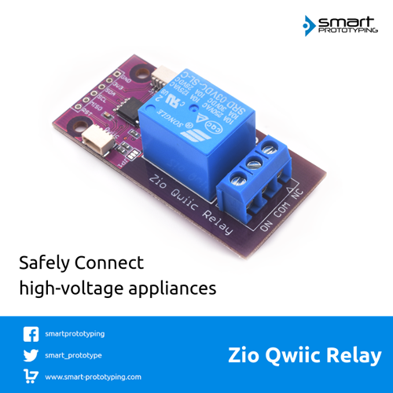

# Zio Qwiic Relay Module

> This product can be available for purchase [here](https://www.smart-prototyping.com/Zio-Qwiic-Relay).

#### Description

Sometimes we need to control high voltage appliances to work with our components. To control that high current, we send an MCU command to a relay module. There are many relay modules out there that can do just that, but what is so great about ours is, it has I2C feature embedded in the module, hence the name ‘Qwiic Relay Module’.

By adding an I2C gateway MCU (ATTINY85-20SU), we have turned this relay module into Qwiic compatible module, no more complications with jumper wire connections, just connect with Qwiic cable!

> Warning: The max. load of this module is not the relay itself, it is the line that connects the pins on the PC. Our module max. allowed current is 4.5A! For your safety, do not connect to devices that are higher than 4.0A.  

#### Specification

* MCU Operation Voltage: 3.3V
* Max. Load for appliances: 4.0A at 125V AC or 250V AC
* Gateway MCU: ATTINY85-20SU
* I2C address: 0x07- 0x78 (Default:0x18)
* Weight: 17.0G
* Dimension: 27.4 x 55.9 x 17.2 (H) mm

#### Links

* [Eagle File and gerber files](https://github.com/ZIOCC/Zio-Qwiic-Relay-Module)
* [Schematic](https://github.com/ZIOCC/Zio-Qwiic-Relay-Module/blob/master/Zio%20Qwiic%20Relay%20Module%20Schematic%20PDF.pdf)
* [Gateway firmware](https://github.com/ZIOCC/Zio-Qwiic-Relay-Module/tree/master/firmware/Qwiic_Relay_Gateway_Firmware)

> This Qwiic version Relay module is referenced from [Sparkfun's Qwiic Relay](https://www.sparkfun.com/products/14712) design and their firmware.

> The gateway MCU is ATTINY85-20SU, check out the datasheet [here](https://www.mouser.com/datasheet/2/268/Atmel-2586-AVR-8-bit-Microcontroller-ATtiny25-ATti-1315542.pdf).

> ###### About Zio
> Zio is a new line of open sourced, compact, and grid layout boards, fully integrated for Arduino and Qwiic ecosystem. Designed ideally for wearables, robotics, small-space limitations or other on the go projects. Check out other awesome Zio products [here](https://www.smart-prototyping.com/Zio).

